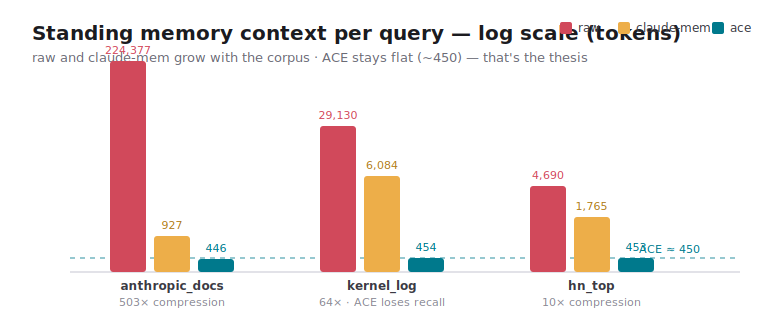

# agent-memory-bench

**Reproduce ACE's agent-memory compression — and verify the claim with your own corpus.**

[](https://github.com/hmatrades/agent-memory-bench/actions/workflows/ci.yml)
[](https://github.com/hmatrades/agent-memory-bench/actions/workflows/benchmark.yml)
[](LICENSE)
[](https://www.python.org)
[](https://github.com/sponsors/hmatrades)

<p align="center"></p>

> Every memory system stores what was said. **ACE stores what matters.** This
> benchmark turns the "~300 tokens vs ~17K" claim into a number you can replicate
> in 60 seconds — across three real public corpora, with `tokens`, `recall@k`,
> and `cost-USD` for **ACE vs claude-mem vs raw**.

---

## Install

```bash
uvx agent-memory-bench          # zero-install run, straight from PyPI
```

No `uv`? `pipx run agent-memory-bench`, or `pip install agent-memory-bench`.

## Quickstart

```bash
uvx agent-memory-bench                      # run all 3 corpora → table
uvx agent-memory-bench run --corpus hn_top  # one corpus
uvx agent-memory-bench run --json           # machine-readable
uvx agent-memory-bench fetch all            # refresh corpora from live sources
uvx agent-memory-bench list                 # corpora + pricing
```

## Why this exists

ACE claims salience-pointer memory replaces ~17K tokens of agent context with
~300. That's a strong claim with no public, runnable proof — so this repo makes
it falsifiable: anyone can clone the method, point it at their own corpus, and
see exactly where ACE wins (context cost) and where it doesn't (recall).

## Docs

- **[BENCHMARK.md](BENCHMARK.md)** — methodology, metric definitions, and the honest caveats (read this before quoting a number).
- **[CONTRIBUTING.md](CONTRIBUTING.md)** — add a corpus, a strategy, or refresh pricing.
- **[results/2026-06-14.json](results/2026-06-14.json)** — the checked-in run behind the table below.

## Results — real numbers (2026-06-14)

Tokenizer `tiktoken/cl100k_base` · pricing `claude-sonnet-4-6` ($3/$15 per MTok) ·
`context_tokens` = standing memory carried per query · `$/query` = cost per query.

### `anthropic_docs` — 20 docs, 20 questions (the canonical agent-context corpus)

| strategy   | context_tokens | recall@1 | recall@5 | recall@10 |   $/query |
|------------|---------------:|---------:|---------:|----------:|----------:|
| raw        |        224,377 |     0.25 |     0.50 |      0.90 | $0.676131 |
| claude-mem |            927 | **1.00** | **1.00** |  **1.00** | $0.005781 |
| **ace**    |        **446** |     0.45 |     0.70 |      0.80 | **$0.004338** |

**Compression: raw ÷ ace context = 503×.**

### `kernel_log` — 100 docs, 50 questions (dense technical text)

| strategy   | context_tokens | recall@1 | recall@5 | recall@10 |   $/query |
|------------|---------------:|---------:|---------:|----------:|----------:|
| raw        |         29,130 |     0.60 |     0.98 |      0.98 | $0.090390 |
| claude-mem |          6,084 | **1.00** | **1.00** |  **1.00** | $0.021252 |
| **ace**    |        **454** |     0.16 |     0.36 |      0.42 | **$0.004362** |

**Compression: 64×.** ACE **loses recall hard here** — see below.

### `hn_top` — 99 docs, 50 questions (conversational corpus)

| strategy   | context_tokens | recall@1 | recall@5 | recall@10 |   $/query |
|------------|---------------:|---------:|---------:|----------:|----------:|
| raw        |          4,690 |     0.90 |     1.00 |      1.00 | $0.017070 |
| claude-mem |          1,765 | **1.00** | **1.00** |  **1.00** | $0.008295 |
| **ace**    |        **453** |     0.86 |     0.98 |  **1.00** | **$0.004359** |

**Compression: 10×.**

### What the numbers actually say (no spin)

- **ACE's context is bounded.** It's ~450 tokens on *every* corpus (446 / 454 / 453)
  while raw and claude-mem grow with the corpus. That's the real thesis: attention
  is flat-cost; content storage is linear. On a lifetime agent corpus, raw is tens
  of thousands of tokens and claude-mem keeps climbing — ACE doesn't move.
- **ACE is the cheapest, by a lot** — ~$0.004/query everywhere, 1.3×–156× cheaper.
- **ACE trades recall for that.** On conversational text it's near-parity (`hn_top`
  r@10 = 1.00). On **dense identifier-heavy text it falls apart** (`kernel_log`
  r@10 = 0.42) — salience pointers throw away the exact SHAs and symbols a commit
  query needs. **If your corpus is identifiers, ACE is the wrong layer.**
- **claude-mem (modeled) wins recall everywhere** at 2×–13× ACE's context cost —
  and that gap widens as the corpus grows. See the honest disclosure on the
  claude-mem baseline in [BENCHMARK.md](BENCHMARK.md).

> Reproduce: `uvx agent-memory-bench run --out my-run.json` and diff against
> `results/2026-06-14.json`. Same frozen snapshots → identical numbers.

## FAQ

**Is this the real ACE / real claude-mem?** ACE's *compression mechanism* is
reproduced faithfully (pointers vs text); its concept extraction is run with a
deterministic offline extractor instead of an LLM so the benchmark needs no API
key (this changes recall quality, not the token ratios). claude-mem is a faithful
**model** of its documented observation-row storage — the live npm package only
emits observations by hooking Claude Code sessions through an LLM, so it can't be
run deterministically offline. Full disclosure in [BENCHMARK.md](BENCHMARK.md).

**Why tiktoken and not Anthropic's tokenizer?** Anthropic ships no offline
tokenizer and `count_tokens` needs the network + a key. `cl100k_base` is the
standard offline proxy; **ratios between strategies are tokenizer-robust** even if
absolute counts drift ~10-20%.

**Why does ACE lose on recall?** By design — it stores *attention*, not content,
and is meant to sit *on top* of a cold store (you query ACE to decide whether to
hit the cold store). This benchmark measures ACE *alone* so the trade-off is
visible, not hidden.

## Contributing

- **Add a corpus** — drop a fetcher in `corpora/fetchers.py` + register it. PRs with
  a new public corpus and its frozen snapshot are the most valuable contribution.
- **Add a strategy** — subclass `Strategy` (`build` / `context_text` / `retrieve`).
  Vector-RAG and summary-recall baselines are wanted.
- **Refresh pricing** — one edit to `metrics/pricing.py` when Anthropic prices move.

See [CONTRIBUTING.md](CONTRIBUTING.md).

## License & support

MIT © 2026 Aiden Hecker. If this saved you a context-budget argument,
[sponsor the work](https://github.com/sponsors/hmatrades).
